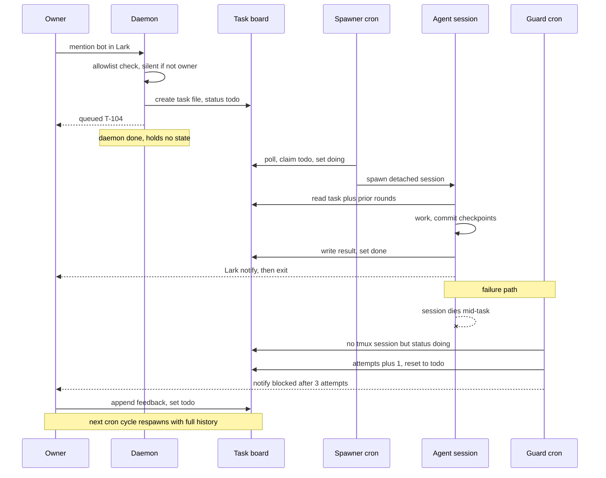
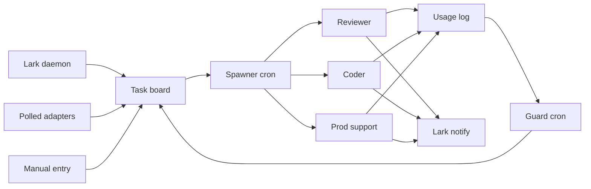
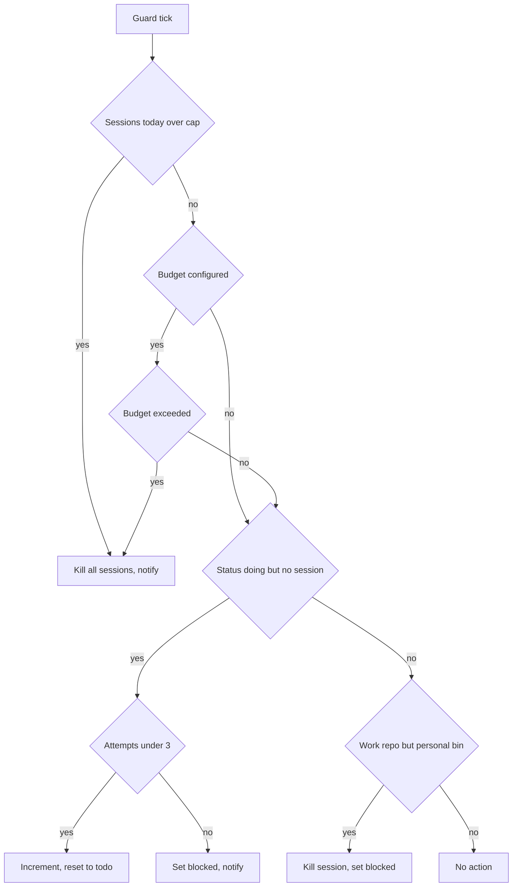

# RFC-001: Personal Claude Agent Fleet

| | |
|---|---|
| **Version** | v3 |
| **Date** | 2026-08-06 |
| **Author** | Surya Darma Putra |
| **Status** | Draft |
| **Profile** | Integration / Automation (secondary: CLI / Tooling) |

### Changelog

| Ver | Date | Change | Verdict |
|---|---|---|---|
| v1 | 2026-08-06 | initial | ⚠️ Feasible with limitations |
| v2 | 2026-08-06 | persona dirs, repos outside root, central logs, `.env.example`, bin naming, all phases retained, budget deferred by config, 6 of 7 open questions closed | ⚠️ Feasible with limitations |
| v3 | 2026-08-06 | session-count guard for week 1, budget expressible in USD, per-model cost table, Appendix B on the $1000 credit scenario | ⚠️ Feasible with limitations |

---

## 1. TL;DR

- Fleet of persona-scoped Claude Code sessions, spawned by cron from a markdown task board, run on VPS or laptop.
- Removes ~2 hrs/day lost to MR review, repeated PM questions, and prod-support context gathering.
- Volume: 10-15 tasks/day, 3 concurrent sessions.
- Cost: $0 incremental on existing subscription.
- Hard constraint: owner is the only trigger. No third-party request may reach a Claude invocation.

## 2. Verdict

> ⚠️ **Feasible with limitations** — mechanism, volume, and access are all now confirmed, but the fleet ships with its token cap deliberately unset, so nothing bounds spend until it is measured and configured.

**Flips if:** `daily_budget_tokens` is set from one week of measured `usage.csv` data → ✅. It does not flip on an org API key any more; that is now assumed unavailable long-term.

Limitations:

- Budget cap unset at launch. Guard enforces nothing until `daily_budget_tokens` has a value. Accepted deliberately; see §9 and Risk 2.
- Agents cannot publish externally. Every MR comment, Jira update, and Lark reply is manual. Throughput is capped by owner review capacity.
- Compliance rests on the daemon allowlist and owner-assigned tasks. Conventions, enforced by review, not by the platform.
- Windows support is via WSL2 or Docker only. No native path.
- Long-term design: assumes no Console API key. A shared bot serving colleagues stays out of scope indefinitely.

## 3. Problem

- ~2 hrs/day lost to interrupt work: MR review, PM questions answerable from existing docs, prod-support context gathering.
- Interrupts arrive in Lark and block deep work; batching them is not currently possible.
- MR queue depth grows when review is deferred; review latency blocks other engineers.
- **Cost of doing nothing:** ~10 hrs/week of senior engineer time, sustained.

## 4. Goals / Non-Goals

| Goals | Non-Goals |
|---|---|
| Owner-triggered fleet, 3 concurrent sessions | Bot serving colleagues — permanently out of scope |
| Task board as single source of truth | Multi-user access to the board |
| Deterministic token cap, configurable | LLM-based budget monitoring |
| Crash-tolerant: dead session costs one phase | Session resume or live migration between hosts |
| Portable across Linux, macOS, Windows via WSL2 or Docker | Native Windows scripts |
| Org-agnostic: adapters are the only extension point | Vendor-specific logic in core |
| Agents never publish externally | Agent write access to GitLab, Jira, Lark threads |

## 5. Proposed Design

### 5.1 Components

- **Task board** → markdown files with YAML frontmatter, git-versioned. Only shared state in the system.
- **Intake adapters** → write task files. Two flavours: `fetch` polled by cron, `run` long-lived daemon.
- **Spawner** → cron, every 5 min in work hours. Claims `todo`, sorts by priority, respects concurrency cap and host filter.
- **Personas** → one directory each: prompt, permissions, binary, defaults.
- **Agents** → detached tmux sessions. One task, one phase, then exit. Communicate only through files.
- **Guard** → cron, every 5 min, always. Budget cap, orphan recovery, credential mismatch. Applies to every persona.
- **Daemon** → optional. Writes task files and calls `bin/now`. Never calls Claude. Not in critical path.
- **KB adapters** → fetch external docs into stamped markdown under `kb/`.
- **CLI** → `bin/fleet`, read-mostly. Lists state, shows cron health, tails logs.

### 5.2 Flow

`intake → tasks/*.md → bin/spawn → agent session → results/*.md + usage.csv → notify → owner review → tasks/*.md`

### 5.3 Stack

| Choice | Reason |
|---|---|
| bash + tmux + cron | No daemon to keep alive. State inspectable with ls, grep, git log. |
| markdown + git board | Free audit trail and rollback. Agents already have file tools. |
| launchd on macOS | cron is deprecated there and does not survive sleep. |
| Docker image | One portable path across all three OSes. |
| Node + Lark SDK, long-connection | Outbound WebSocket. No public URL, no TLS cert, no inbound port. |

**No HTTP framework.** Long-connection mode receives events on a callback, so there is no server to frame. Hono, Express, and Fastify all add a dependency that serves nothing. Add one only if switching to webhook mode, which requires a public endpoint and TLS on the host.

### 5.4 Scale assumption

- 10-15 tasks/day.
- 3 concurrent sessions, cap raised only after one week of usage data.
- 1-2 hosts, partitioned by `host` field, never contending.

### 5.5 Project structure

Project root is any empty directory. Nothing in the tree assumes a name.

```
<project-root>/
  fleet.config.yml            runtime config, gitignored
  fleet.config.yml.example    tracked template, no org specifics
  .env                        secrets, gitignored
  .env.example                tracked template
  install                     preflight, installs cron or launchd

  bin/
    fleet                     CLI entry point, see 5.10
    spawn                     claim tasks, launch sessions
    guard                     budget, orphans, credential mismatch
    task-set                  ONLY frontmatter mutator
    now                       manual spawn, debounced
    report                    aggregate usage.csv
    kb-sync                   run enabled KB adapters

  personas/
    reviewer/
      prompt.md               system prompt, 20-40 lines
      config.json             permissions, bin, workspace, model
    coder/
      prompt.md
      config.json
    prod-support/
      prompt.md
      config.json
    planner/
      prompt.md
      config.json

  intake/
    adapters/
      lark-bot/     run       long-lived, node
      jira-assigned/ fetch    polled, idempotent
      gitlab-mr/    fetch     polled, idempotent

  kb/
    adapters/<name>/fetch
    data/<name>/*.md          stamped with source and fetch date
    INDEX.md                  generated

  .claude/
    agents/                   subagent definitions, shared
    settings.json             hooks: Stop, SessionEnd, Notification

  logs/                       all logs, one place
    fleet.log                 cron heartbeat, all jobs
    intake-lark.log
    intake-jira.log
    agent-<task-id>.log

  tasks/                      gitignored or separate repo
  results/
  scratch/<task-id>/          ephemeral, purged 7 days after done
  usage.csv
```

Repos live **outside** the project:

```
<repos_root>/                 default ../fleet-repos
  app/                        full clone
  api/
  .worktrees/<task-id>/       coder worktrees
```

Rationale: repos are large, org-specific, and per-machine. Keeping them out means a stranger can clone the project with nothing of yours in it.

### 5.6 Directory purposes

| Dir | Holds | Lifecycle |
|---|---|---|
| `tasks/` | task files, all statuses | permanent, git history |
| `results/` | agent output, one file per task, rounds appended | permanent |
| `scratch/<task-id>/` | working files for repo-less tasks: pulled logs, notes, drafts | purged 7 days after `done` |
| `logs/` | cron heartbeat, adapter output, per-agent session logs | rotated at 10 MB, keep 3 |
| `kb/data/` | synced external docs, stamped | overwritten each sync |
| `<repos_root>/` | full clones plus worktrees | permanent, machine-local |

### 5.7 Task file contract

```markdown
---
id: mr-1204
status: todo          # todo | doing | done | blocked | stale
persona: reviewer
phase: 1              # coder only: 1 plan, 2 implement, 3 test
priority: normal      # high | normal
workspace: repo-ro    # worktree | repo-ro | scratch
repo: app
host: vps             # unset = primary host
attempts: 0
source: gitlab-mr
---
Review MR 1204. Focus: migration safety, N plus 1 queries.

## Round 1
<agent output>

## Feedback
<owner input, then set status back to todo>
```

### 5.8 Persona directory contract

```
personas/reviewer/
  prompt.md      appended to system prompt
  config.json    everything else
```

```json
{
  "bin": "claude-work",
  "workspace": "repo-ro",
  "model": "sonnet",
  "permissions": {
    "allow": ["Read", "Grep", "Glob", "Bash(git diff:*)", "Bash(git log:*)"],
    "deny": ["Write", "Edit", "Bash(git push:*)", "Bash(glab:*)"]
  }
}
```

Prompt and permissions stay together because they describe the same thing: what this agent is allowed to be. A folder also leaves room for per-persona subagents and fixtures later without another naming decision.

Reviewer output format is fixed by the existing review skill: list of files, each with labelled comments. `results/` inherits that format unchanged, which makes the findings-posted ratio countable without parsing.

### 5.9 Workspace modes

| Mode | Used by | Location | Isolation |
|---|---|---|---|
| `worktree` | coder | `<repos_root>/.worktrees/<task-id>` | own branch, writes permitted in-tree |
| `repo-ro` | reviewer | `<repos_root>/<repo>` | read-only, no branch, all writes denied |
| `scratch` | prod-support, planner | `scratch/<task-id>/` | empty dir plus kb read-only plus MCP, no repo |

### 5.10 CLI

Single entry point: `bin/fleet`. Read-mostly by design — inspection is safe, mutation goes through `task-set`.

| Command | Does | Reads |
|---|---|---|
| `fleet tasks` | list tasks, grouped by status, host, persona | `tasks/*.md` |
| `fleet tasks --status doing` | filter by any frontmatter field | `tasks/*.md` |
| `fleet agents` | running sessions, task id, persona, uptime | `tmux ls` |
| `fleet adapters` | intake plus KB adapters, enabled flag, last run, last exit code | `intake/`, `kb/`, `logs/fleet.log` |
| `fleet cron` | installed schedule plus last 5 runs per job with exit code | crontab or launchd, `logs/fleet.log` |
| `fleet logs [job] [-n 5]` | tail recent entries, default 5 | `logs/` |
| `fleet usage [--since 7d]` | tokens by persona and task, cache split | `usage.csv` |
| `fleet budget` | sessions today vs cap, tokens or USD spend, percent used | `fleet.config.yml`, `usage.csv` |
| `fleet doctor` | preflight: binaries resolve, cron installed, adapters healthy, budget set, stale locks | all of the above |
| `fleet now` | alias for `bin/now` | — |

Exit codes: `0` ok, `1` usage error, `2` degraded — a check failed but the fleet still runs, `3` fleet stopped by guard.

**Cron health requires a heartbeat.** Cron does not record whether a job ran. Every scheduled job appends one line to `logs/fleet.log`, success or failure:

```
2026-08-06T09:05:01Z spawn      exit=0 claimed=2 running=3
2026-08-06T09:05:02Z guard      exit=0 killed=0 orphans=1 sessions=9/25 tokens=412k budget=unset
2026-08-06T09:10:00Z jira-sync  exit=1 error=auth_expired
```

Fixed-width prefix, `key=value` after. Greppable without a parser. A job missing from recent output means cron itself is not firing — the failure mode that would otherwise be silent.

### 5.11 Configuration

Two files. Non-secret in `fleet.config.yml`, secrets in `.env`. Neither is committed; both have tracked `.example` twins.

```yaml
# fleet.config.yml.example
host: vps                       # this machine's partition label
repos_root: ../fleet-repos
max_agents: 3
work_repo_prefix: app,api       # repos requiring the work binary

claude_bin: claude              # default for all personas

budget:
  max_sessions_per_day: 25      # crude ceiling, active from day 1
  daily_budget_tokens:          # empty until measured, see 5.11
  daily_budget_usd:             # use instead of tokens when on an API key
  warn_at_percent: 80

schedule:
  spawn: "*/5 9-18 * * 1-5"
  guard: "*/5 * * * *"
  intake: "*/15 9-18 * * 1-5"
  kb_sync: "0 7 * * 1-5"
```

```bash
# .env.example
FLEET_HOST=vps
CLAUDE_BIN=claude
CLAUDE_BIN_WORK=claude-work

LARK_APP_ID=
LARK_APP_SECRET=
LARK_ALLOWLIST_OPEN_ID=          # comma-separated, owner only
LARK_WEBHOOK_URL=                # outbound notify

GITLAB_BASE_URL=
GITLAB_TOKEN=                    # read-only scope, adapters do not post

JIRA_BASE_URL=
JIRA_EMAIL=
JIRA_API_TOKEN=                  # read-only scope

LARK_DOC_APP_ID=                 # kb adapter, optional
LARK_DOC_APP_SECRET=
```

**Two ceilings, different jobs.** `max_agents` bounds concurrent load; `max_sessions_per_day` and the budget keys bound daily spend. Neither drops tasks — a task not claimed this tick stays `todo` and is claimed on a later one.

**Week 1 uses the session count, not tokens.** `max_sessions_per_day: 25` is exact and needs no estimate, where a guessed token cap either does nothing or kills the fleet at 11am on day two. At 12-15 tasks/day, 25 only fires on a genuine runaway: a retry loop, or an adapter duplicating rows.

**Token and USD caps stay empty until measured.** With both empty, guard logs `budget=unset`, skips the value check, and enforces only the session count. To enable:

1. Run one week with 3 agents. `fleet usage --since 7d` gives tokens per completed task.
2. `daily_budget_tokens = median_tokens_per_task × expected_tasks_per_day × 1.3`. At 12 tasks/day this is a single arithmetic step.
3. Set the value, run `fleet budget` to confirm it reads back, then `fleet doctor` should stop reporting degraded.
4. Guard now kills all sessions on breach and pushes a Lark notification.

On a subscription, use `daily_budget_tokens` — there is no dollar figure to track. On an API key, use `daily_budget_usd`; guard prices each session from `usage.csv` using the rate table in Appendix B. Set one or the other, never both.

Two hosts split the cap: set `daily_budget_tokens` to the total divided by host count. Usage aggregates per account, and each host only sees its own transcripts.

### 5.12 Daemon contract

| May | May not |
|---|---|
| create `tasks/<id>.md` | modify existing frontmatter |
| read task status | write `results/`, `kb/`, `usage.csv` |
| relay `results/` verbatim | interpret or summarize results |
| exec `bin/now`, max 1 per 30s | call any Claude binary |
| write `logs/intake-lark.log` | write any other log |
| reply to allowlisted owner | reply to anyone else — failure mode is silence |

## 6. Diagrams

### 6.1 Sequence — notice that the daemon exits before Claude is ever invoked, and that failures re-queue rather than retry in place



### 6.2 Architecture — notice every persona feeds the usage log, and the guard acts on all of them, not just the coder



### 6.3 Flowchart — guard decision path, applied to every running session regardless of persona



### 6.4 ER

_N/A — no relational schema. Board is flat files._

## 7. Alternatives

| Axis | A: files plus cron | B: Go backend service | C: Hermes full bot | Do nothing / manual |
|---|---|---|---|---|
| Wiring effort | 6 eng-days | 14 eng-days | 10 eng-days | 0 |
| Ops burden | Low — cron, no daemon | Med — process to supervise | Med — router plus daemon | Low |
| Infra cost | `$` $0, existing VPS | `$` $0 plus one process | `$$` $10-40/mo second model | $0 |
| Cost per run | ~$0 on subscription | ~$0 on subscription | $0.01-0.05 trivia, rest same | $0 |
| Time to first value | 3 days | 3 weeks | 2 weeks | now |
| Blast radius | Low — cron stops, files intact | Med — dead service stops fleet silently | High — serves others, credential exposure | None |
| Reversibility | Easy — delete dir | Med — rewrite to files | Hard — users depend on it | Easy |
| Rate limits / quota | Subscription interactive limits | Same | Same plus second vendor quota | None |
| Vendor SLA | None, self-hosted | None | Second vendor dependency | None |
| **Score → Pick** | **✅ Winner** | | ❌ non-compliant as scoped | fallback if quality fails |

Why the losers lost:

- B: adds a process that can die silently while producing identical logs to what Claude Code already writes to disk.
- C: as originally scoped it routed colleague requests to a subscription credential. Compliant only if reduced to an owner-gated file writer, at which point it is A plus a router.
- Do nothing: remains correct if the findings-posted ratio stays below 0.5 after phase 2.

## 8. Risks & Mitigations

| Risk | Likelihood | Impact | Mitigation |
|---|---|---|---|
| Value cap unset in week 1 | Med | Med — bounded by `max_agents: 3` and `max_sessions_per_day: 25`, not unbounded | Session count active from day 1. `fleet doctor` reports degraded until a value cap is set. Set by end of week 1 |
| Non-owner trigger path added later | Med | Critical — ToS violation on employer seat | Allowlist in daemon, board write access owner-only, Appendix A invariants |
| Two hosts double-spawn same task | Med | Med — duplicate cost, conflicting worktrees | `host` partitioning, host-scoped orphan recovery |
| Agent hallucinates a review finding | Med | Med — wrong comment on colleague MR | Agents never post. Owner publishes every external artifact |
| Stale KB answers prod question wrongly | Med | High — incorrect incident guidance | Every KB file stamped with source and fetch date, persona must cite both |
| Unattended agent runs destructive command | Low | High | Per-persona deny rules. reviewer and prod-support are read-only |
| Coder session dies mid-task | Med | Low | Phased execution, git checkpoints, idempotent resume from git log |
| Credential mismatch: work repo on personal binary | Low | Med | Guard checks `work_repo_prefix` against persona `bin`, kills and blocks |
| Daemon crash | Med | Low | Not in critical path. Cron continues, fallback is editing files by hand |
| `scratch/` grows unbounded | Med | Low | Purge on guard tick, 7 days after `done` |

## 9. Cost

| Item | Amount | Notes |
|---|---|---|
| Infra | $0/mo | existing VPS |
| Claude usage | $0/mo | existing subscription, interactive |
| Eng effort | 6 days | across all 5 phases |
| Ongoing ops | ~1 hr/wk | persona tuning, budget review |
| **Total y1** | **$0** | no API key assumed, long-term |

At 10x volume — 150 tasks/day — subscription interactive limits bind first, not cost. The fleet stops; it does not bill more. That is the structural difference from an API-key design and the reason cost is not the risk here. The risk is the ceiling, and `daily_budget_tokens` is what makes hitting it a controlled event rather than a surprise.

## 10. Rollout

All five phases are in scope. Each still has an exit criterion, so a failing phase stops the sequence rather than being discovered three phases later.

| Phase | Does | Exit criteria | Rollback |
|---|---|---|---|
| 1 | Scaffold project, config, `.env`, `bin/fleet`, reviewer persona, manual task files | `fleet doctor` exits 0 except budget. Reviewer output on 5 real MRs matches the skill's file-plus-labelled-comments format | delete project dir |
| 2 | `bin/spawn`, `bin/guard` with session-count cap active, cron install, worktree isolation, cap 2 | 3 consecutive days unattended, no wrong-branch or wrong-repo incident, heartbeat present for every tick | `crontab -r` |
| 3 | usage.csv via SessionEnd hook, `fleet usage`, raise cap to 3, then set a value cap | 1 week of data, `fleet budget` reads back a value, guard logs `budget=<n>` not `unset` | `crontab -r`, unset budget |
| 4 | Lark notify out, then Lark daemon in, allowlist enforced | Notifications fire for done and blocked. Non-allowlisted user gets silence, verified | remove `enabled` from adapter |
| 5 | coder persona with phases, planner, KB adapters, Jira and GitLab intake | Feedback round 2 measurably better than round 1. KB citations include source and fetch date | remove persona dir or adapter |

Phase 3 completes before the cap exceeds 3. Do not raise concurrency while the budget is unset.

## 11. Measurement

| KPI | Baseline | Target | Instrumented by | Review date |
|---|---|---|---|---|
| Interrupt hours/day | ~2 | under 1 | manual log | +30 days |
| MR review latency | ? | under 4 hrs | gitlab-mr adapter timestamps | +30 days |
| Tokens per completed task | ? | measured, then capped | usage.csv | +7 days |
| Findings posted / findings generated | 0 | above 0.5 | count labelled comments in `results/` versus posted | +14 days |
| Feedback rounds per task | ? | under 2 | task file round count | +30 days |

Findings-posted ratio is the quality signal that matters. The review skill's labelled-comment format makes it countable without parsing. Below 0.5 sustained means the reviewer persona generates more noise than value.

## 12. Monetization

_N/A — internal productivity tool, no revenue path._

## 13. Open Questions

| # | Question | Owner | Needed by |
|---|---|---|---|
| 1 | `daily_budget_tokens` value | Surya | end of phase 3 |
| 2 | Lark Node SDK package and WebSocket client name confirmed | Surya | before phase 4 |
| 3 | What is the $1000 / 3 months — Console API credit, or seat funding | Surya | before phase 1 — see Appendix B |

Closed in v2: repo approval granted · GitLab reachable without VPN · volume 10-15 tasks/day · reviewer skill format confirmed · Lark SDK language is Node · org API key assumed unavailable long-term.

## 14. Recommendation

- **Do:** phase 1, and treat the reviewer output check as a real gate — 5 MRs, count what you would actually post.
- **Don't:** raise concurrency past 3, or add personas, before `daily_budget_tokens` is set. Unbounded spend on an unmeasured ceiling is the one failure that blocks your interactive work too.
- **Revisit when:** the findings-posted ratio drops below 0.5 for two weeks, or a second person asks for access — the latter requires a new RFC, not a config change.

---

## Appendix A: Compliance invariants

These are load-bearing. Changing any one requires a new RFC version.

1. Only the owner may cause a Claude invocation. Adapters write files; cron spawns; no external event reaches a Claude binary directly.
2. All tasks are assigned to the owner. The board is not a queue others can fill.
3. Daemon allowlist failure mode is silence, never a reply.
4. Agents never write to GitLab, Jira, or Lark threads. The owner publishes all external artifacts.
5. Work repos run only on the work binary. Enforced by guard, not by memory.
6. Throughput is bounded by owner review capacity and, once configured, by a hard token cap.

---

## Appendix B: cost model and the $1000 credit scenario

### B.1 Rates, August 2026

| Model | Input /Mtok | Output /Mtok | Cache hit |
|---|---|---|---|
| Opus 5 | $5.00 | $25.00 | 10% of input |
| Sonnet 5 | $2.00 until Aug 31, then $3.00 | $10.00 until Aug 31, then $15.00 | 10% of input |
| Haiku 4.5 | $1.00 | $5.00 | 10% of input |

Batch API halves both sides. Not applicable here — sessions are interactive-shaped, not batchable.

### B.2 Per-task cost

Assumption: ~200k input per task, 85% cache hits, ~20k output. Post-September Sonnet rates.

| Persona | Model | Per task |
|---|---|---|
| Reviewer | Sonnet 5 | ~$0.45 |
| Coder, per phase | Opus 5 | ~$1.10 |
| Prod support | Opus 5 | ~$0.80 |
| Planner | Sonnet 5 | ~$0.30 |

Daily mix at 8 reviews plus 4 coder phases plus 3 prod: **~$10.40/day**, ~$225/month.

### B.3 If the $1000 is Console API credit

**The verdict flips to ✅ and this document needs a v4.** Material changes:

| Constraint | On subscription | On API credit |
|---|---|---|
| Trigger | owner only, hard invariant | any trigger permitted |
| Colleagues | permanently out of scope | a shared bot becomes legitimate |
| Agents publishing | never | can post MR comments directly |
| Ceiling | interactive usage limits, opaque | $1000, exact and observable |
| Budget key | `daily_budget_tokens` | `daily_budget_usd` |
| Appendix A invariants | load-bearing | mostly obsolete |

Budget arithmetic: $1000 over 65 working days is **$15.40/day**, against ~$10.40/day estimated usage. ~33% headroom, or ~$670 consumed over 3 months.

In IDR at ~Rp 16,300/USD: ~Rp 16.3 juta total, ~Rp 3.7 juta/month, ~Rp 250rb/day. FX approximate.

**Do not assume this.** The $1000 may be seat funding, a team-plan allocation, or a general tooling budget — none of which grant API access. Confirm in Console before designing around it. If it is credit, the correct move is not to bolt it onto this design but to re-run the RFC: most of the complexity here exists to work around a credential ceiling that credit removes.
